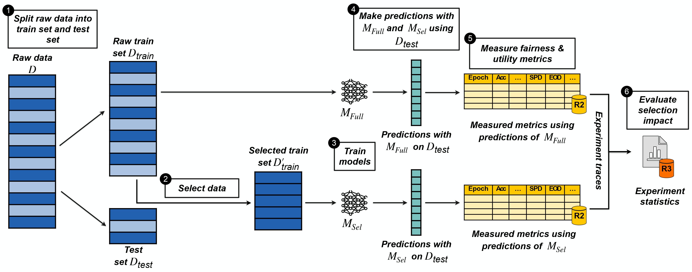

# ELAPSE

**ELAPSE** is a framework for evaluating the impact of data selection methods on ML model utility and fairness.  
It supports configurable experiments across a variety of datasets, ML models, and a wide range of ML data sélection methods, and using various fairness metrics, and utility metrics. As a result, ELAPSE produces the experiment traces and their statistical analysis.

<p align="center">
  
</p>

In the following, we introduce:

- [ELAPSE Features](#elapse-features)  
- [Repository Structure](#repository-structure)  
- [Starting with ELAPSE](#starting-with-elapse)  
- [Running an Experiment](#running-an-experiment)  
- [Producing Traces and Statistics](#producing-traces-and-statistics)  
- [Contributing](#contributing)  
- [Acknowledgments](#acknowledgments)  
- [Publications](#publications) 

---


## ELAPSE Features

- Evaluation of selection methods on fairness and utility metrics  
- Built-in support for common ML models and real-world datasets  
- Modular design for easy extension  
- Epoch-level and aggregated result tracing  
- Integrated t-test analysis for selection impact and variability  


## Repository Structure
```bash
├── code/
│   ├── configs/                  # Experiment configurations
│   ├── dataselection/           # Core modules for data selection 
│   │   ├── selectionmethods/    # Data selection methods
│   │   └── utils/               # Dataset loading and model utilities
│   └── statistics/              # Trace statistics and t-test results
├── datasets/                    # ELAPSE datasets
├── results/                     # Output results per configuration
├── traces/                      # Aggregated metrics and t-test results
└── README.md
```
---

## Starting with ELAPSE

### Software Requirements
- Python ≥ 3.8  
- All dependencies listed in `code/requirements.txt`

### Hardware Recommendations
Experiments can be run on CPU or GPU. A CUDA-compatible GPU is recommended for faster training when using deep models or large datasets.

### Installation

To install the latest ELAPSE version from source

```bash
git clone https://github.com/sara-bouchenak/ELAPSE/
cd ELAPSE
pip install -r requirements.txt
```


## Running an Experiment

1. Create a JSON configuration file in `code/configs/`.

   Example configuration:

   ```json
   {
     // Datasets & sensitive attributes
     "dataset_name": "ars",
     "sensituve_attributes": ["gender"],
     "columns": ["gender", "labels"],
     "dataset_path": "../Datasets/ARS/",
     "train_file": "train_ars.csv",
     "test_file": "test_ars.csv",
     "val_file": "val_ars.csv",
     "data_load": "load-ars",

     // ML models
     "models": ["MLP", "SVM", "Logreg"],

     // ML model hyperparameters
     "lr": 0.001,
     "batch_size": 512,
     "epoch": 400,
     "label_num": 2,
     "log_interval": 50,
     "runs": 5,

     // Data selection configuration
     "fraction": 0.05,
     "select_every": 20,
     "ratios": [0.05, 0.1, 0.2, 0.3],
     "values": [3],  // 0=Full, 2=GradMatch, 3=Craig, 4=Glister, 5=Random

     

     // Output
     "result_path": "./results/ARS",
     "cols": [
       "SPD_gender", "EOD_gender", "AOD_gender",
       "DI_gender", "DcI_gender", "F1_score",
       "Precision", "Recall"
     ]
   }

2. Prepare the result folder structure.

```bash
results/<result_path>/
  └── <method_name>/
      └── <dataset_name>_<selection_ratio>/
```

3. Run the experiment.

```bash
python code/main.py --config code/configs/config.json
```

---

## Producing Traces and Statistics

ELAPSE supports detailed trace logging and statistical analysis to evaluate the impact of data selection on model fairness and utility.

### Output Trace Files

- `ExperimentMeasurements.csv`: Epoch-wise metrics for each run across configurations  
- `ExperimentStatistics.csv`: Aggregated metrics along with t-test results  
- `ExperimentConfigurations.csv`: All evaluated configuration details  
- `DatasetProperties.csv`: Metadata about datasets and associated sensitive attributes  

### Running the Analysis

Use the following notebooks to generate trace files and conduct statistical tests:

```bash
# Applies t-tests to evaluate selection impact on utility and fairness
jupyter notebook code/statistics/selection-impact-t-test.ipynb

# Applies t-tests to assess variability across experimental runs
jupyter notebook code/statistics/variability-t-test.ipynb

# Generate result trace files
jupyter notebook code/statistics/traces.ipynb
```

---

## Contributing

We value and encourage contributions from the research and open-source communities to improve the ELAPSE framework. ELAPSE is designed to be modular and extensible, making it easy to integrate new datasets, selection methods, or models.

### How to Extend ELAPSE

- **Add new datasets**:  
  Update the dataset builder in `dataselection.utils.data.datasets` to integrate a new dataset along with its preprocessing.

- **Implement new selection methods**:  
  Extend `dataselection/selectionmethods/` with a new data selection method, and `dataselection.utils.data.dataloader` to account for it.

- **Add new model architectures**:  
  Define additional models in `dataselection.utils.models` and ensure they are compatible with the training pipeline.

- **Improve metrics and trace handling**:  
  Add new fairness/utility metrics, and enhance the statistical analysis workflow.

 

### Contribution Guidelines

We welcome all types of contributions. Please follow these guidelines to ensure smooth collaboration:

- **Report issues**:  
  If you encounter bugs or have suggestions for improvement, open an issue on the GitHub repository. Include as much relevant detail as possible (e.g., error messages, dataset/config used, and reproduction steps).

- **Propose new features**:  
  For new features or enhancements, submit a feature request. Clearly describe the motivation, proposed functionality, and how it aligns with ELAPSE’s goals.

- **Code contributions**:  
  To contribute code:
  1. Fork the ELAPSE repository.
  2. Create a new branch from `main` or an appropriate development branch.
  3. Implement your changes and ensure they are well-documented and, where applicable, tested.
  4. Submit a pull request with a clear explanation of the changes and their purpose.

- **Code style**:  
  Follow the existing code structure and conventions used in ELAPSE. Consistency improves readability and facilitates code reviews.

- **Testing**:  
  Ensure your changes pass existing tests and, if introducing new features, provide relevant tests.


For substantial changes, consider opening a discussion or draft pull request first to align with the maintainers on design choices.
For any questions or follow-up, please contact the repository maintainers at [nawel.benarba@insa-lyon.fr](mailto:nawel.benarba@insa-lyon.fr), [zeyang.kong@insa-lyon.fr](mailto:zeyang.kong@insa-lyon.fr), and [sara.bouchenak@insa-lyon.fr](mailto:sara.bouchenak@insa-lyon.fr).


---

## Acknowledgments

ELAPSE extends [CORDS](https://github.com/decile-team/cords) by adding support for new datasets with associated sensitive attributes, integrating additional model architectures, and computing a comprehensive set of utility and fairness metrics. We thank the open-source community for the foundational tools and contributions that supported the development of this framework.

---

## Publications

The following publications are related to the data selection strategies supported in ELAPSE.

[1] Krishnateja Killamsetty, Durga Sivasubramanian, Ganesh Ramakrishnan, Abir De, Rishabh Iyer.  
“GRAD-MATCH: Gradient Matching based Data Subset Selection for Efficient Deep Model Training”.  
*Proceedings of the 38th International Conference on Machine Learning (ICML), 2021*, PMLR 139:5464–5474.

[2] Krishnateja Killamsetty, Durga Sivasubramanian, Ganesh Ramakrishnan, Rishabh Iyer.  
“GLISTER: Generalization based Data Subset Selection for Efficient and Robust Learning”.  
*Thirty-Fifth AAAI Conference on Artificial Intelligence (AAAI), 2021*, pp. 8110–8118.

[3] Baharan Mirzasoleiman, Jeff Bilmes, Jure Leskovec.  
“Coresets for Data-efficient Training of Machine Learning Models”.  
*International Conference on Machine Learning (ICML), 2020*.

   


